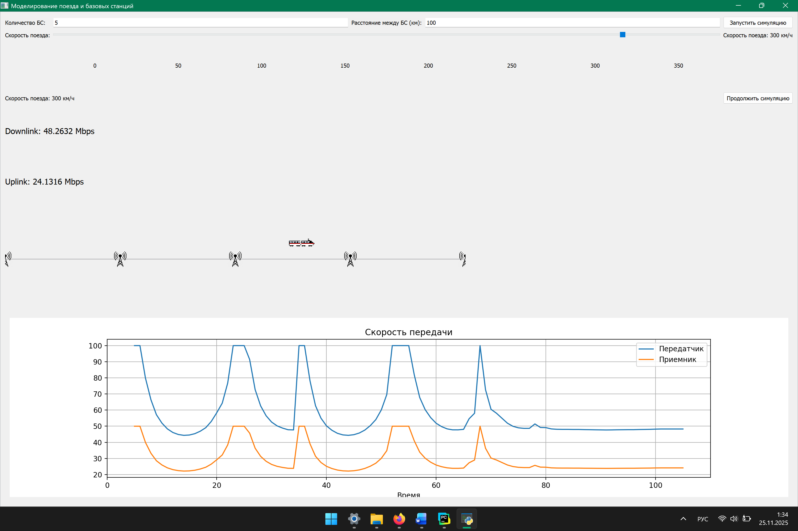

# Разработка приложения 

## Модуляция передачи данных между поездного состава и базовой станцией 
В рамках нашего мини проекта нам необходимо реализовать программу, которая будет модулировать сигнал от поездного состава до базовой станции при помощи простейшего модели затухания сигнала в канале связи, чем ближе поезд к станции — тем сильнее сигнал.
Результат работы представлен на рисунке ниже



В начале нам необходимо создай файл ```Main.py``` который будет запускать нашу программу и создать в нем класс ```MainWindow```
```python

class MainWindow():
    pass

if __name__ == '__main__':
    pass
```
Вот такой шаблон у нас получился, далее нам необходимо подключить необходимые библиотеки. Для нашего проекта будем использовать библиотеку PyQt5.
```python
pip install PyQt5 
```
После установки нам необходимо импортировать след классы
```python
from PyQt5.QtWidgets import QApplication, QScrollArea, QMainWindow
```
    QApplication — управляет жизненным циклом GUI-приложения.
    QScrollArea — добавляет прокрутку (если содержимое не помещается).
    QMainWindow — главное окно приложения.
     
Так же необходимо импортировать библиотеку 
```python
import sys
```
Используется для работы с аргументами командной строки и завершения программы через sys.exit()

Приступим к написанию кода, в начале создадим функцию ```__init__``` 

```__init__ ```— это специальная функция, которая вызывается при создании нового объекта класса. Она также известна как конструктор класса. Это место, где обычно устанавливаются начальные значения атрибутов класса.

```self``` — это ссылка на текущий экземпляр класса. Это способ обращения к атрибутам и методам класса изнутри самого класса.

```python
class MainWindow(QMainWindow):
    def __init__(self):
        # Вызывает конструктор родительского класса QMainWindow.
        super().__init__()
        # Устанавливает заголовок окна
        self.setWindowTitle("Моделирование поезда и базовых станций")
        # Устанавливает размер и положение окна на экране: 
        # X=100, Y=100 — координаты верхнего левого угла экрана
        # Ширина=1200, Высота=700 — размеры окна.
        self.setGeometry(100, 100, 1200, 700)

        # Создаёт область с прокруткой — нужно, если содержимое больше, чем позволяет размер окна.
        scroll_area = QScrollArea()
        # Создаёт основной интерфейс приложения — форму с полями ввода, графиками и симуляцией.
        content_widget = TrainSimulatorUI()
        # Устанавливает TrainSimulatorUI как содержимое области прокрутки.
        scroll_area.setWidget(content_widget)
        #Позволяет содержимому растягиваться под доступное пространство внутри QScrollArea. 
        scroll_area.setWidgetResizable(True)
        # Делает область прокрутки центральным виджетом главного окна.
        self.setCentralWidget(scroll_area)
        
if __name__ == '__main__':
    # Создаёт экземпляр приложения Qt.
    # sys.argv позволяет передавать параметры из командной строки.
    app = QApplication(sys.argv)
    # Создаёт главное окно приложения (MainWindow)
    window = MainWindow()
    # Отображает окно на экране.
    window.show()
    # Запускает цикл обработки событий Qt.
    # При выходе из приложения программа корректно завершится через sys.exit().
    sys.exit(app.exec_())
```

После чего нам необходимо создать класс ```TrainSimulatorUI``` для этого создадим файл ```train_simulator_ui.py``` и в нем создадим класс.

```python
class TrainSimulatorUI(QWidget):
    def __init__(self):
        super().__init__()
```
Так же тут нам понадобятся след. зависимости:
```python
from PyQt5.QtWidgets import (
    QWidget, QVBoxLayout, QLabel,
    QLineEdit, QPushButton, QSlider,
    QGridLayout, QMessageBox
)
from PyQt5.QtCore import Qt
```
    QWidget — базовый виджет,
    QLabel, QLineEdit — текстовая метка и поле ввода,
    QPushButton — кнопка,
    QSlider — ползунок,
    QMessageBox — окно сообщений,
    QVBoxLayout, QGridLayout — контейнеры для компоновки элементов.
    Qt - модуль с константами и базовым функционалом
     
Теперь нам необходимо создать начальные атрибуты такие как: поля ввода, слайдер скорости, метка скорости, кнопки, вывод данных, стиль.
Получаем след. картину:
```python
class TrainSimulatorUI(QWidget):
    def __init__(self):
        super().__init__()

        self.simulation_pane = SimulationPane()
        self.signal_chart_pane = SignalChartPane()

        # Поля ввода
        self.base_stations_field = QLineEdit("5") # количество базовых станций 
        self.distance_field = QLineEdit("100") # расстояние между бс

        # Слайдер скорости
        # Горизонтальный слайдер для выбора скорости поезда:
        #   От 0 до 350 км/ч
        #   Начальное значение: 300 км/ч.
        self.speed_slider = QSlider(Qt.Horizontal)
        self.speed_slider.setMinimum(0)
        self.speed_slider.setMaximum(450)
        self.speed_slider.setValue(300)
        self.tick_labels_layouts = QGridLayout()

        # Метка скорости
        # обработчик изменения значения слайдера.
        self.current_speed_label = QLabel(f"Скорость поезда: {self.speed_slider.value()} км/ч")
        self.speed_slider.valueChanged.connect(self.update_speed_label)

        # Кнопки
        self.start_button = QPushButton("Запустить симуляцию")
        self.toggle_button = QPushButton("Остановить симуляцию")

        # Лейблы для вывода данных
        self.downlink_label = QLabel("Downlink: 0 Mbps")
        self.uplink_label = QLabel("Uplink: 0 Mbps")

        # Установка стилей
        # Метки для отображения текущих значений связи. 
        self.downlink_label.setStyleSheet("font-size: 16px;")
        self.uplink_label.setStyleSheet("font-size: 16px;")

```
Создадим компонент ```self.init_ui()``` в котором будет находиться всь нащ дизайн
```python
    def init_ui(self):
        layout = QVBoxLayout(self)

        # Верхняя панель управления
        control_layout = QGridLayout()

        control_layout.addWidget(QLabel("Количество БС:"), 0, 0)
        control_layout.addWidget(self.base_stations_field, 0, 1)
        control_layout.addWidget(QLabel("Расстояние между БС (км):"), 0, 2)
        control_layout.addWidget(self.distance_field, 0, 3)
        control_layout.addWidget(self.start_button, 0, 4)

        control_layout.addWidget(QLabel("Скорость поезда:"), 1, 0)
        control_layout.addWidget(self.speed_slider, 1, 1, 1, 3)
        control_layout.addWidget(self.current_speed_label, 1, 4)

        # Добавляем в основную сетку под слайдер
        self.tick_labels_layout()
        control_layout.addLayout(self.tick_labels_layouts, 2, 1, 1, 3)  # строка 2, колонки 1-3

        control_layout.addWidget(self.toggle_button, 3, 4)
        control_layout.addWidget(QLabel(self.current_speed_label.text()), 3, 0, 1, 4)
        control_layout.addWidget(self.downlink_label, 4, 0, 1, 5)
        control_layout.addWidget(self.uplink_label, 5, 0, 1, 5)

        layout.addLayout(control_layout)

        self.setLayout(layout)

```
Создадим функцию ```start_simulation```

При нажатии на кнопку "Запустить симуляцию": 

    Получает параметры из полей ввода,
    Передаёт их в simulation_pane,
    Если данные некорректны — выводит сообщение об ошибки

```python
def start_simulation(self):
    try:
        num_stations = int(self.base_stations_field.text())
        station_distance = float(self.distance_field.text())

        self.simulation_pane.start_simulation(num_stations, station_distance)
    except ValueError:
        QMessageBox.critical(self, "Ошибка", "Введите корректные числа.")
```
Далее создадим функцию tick_labels_layout которая сделает наглядные отметки скорости 
```python
def tick_labels_layout(self):
    ticks = [0, 50, 100, 150, 200, 250, 300, 350]

    for col, value in enumerate(ticks):
        label = QLabel(str(value))
        label.setAlignment(Qt.AlignCenter)
        self.tick_labels_layouts.addWidget(label, 0, col)

    # Уменьшаем расстояние между метками
    self.tick_labels_layouts.setHorizontalSpacing(0)
    self.tick_labels_layouts.setContentsMargins(0, 0, 0, 0)
```
Для обновления информации о сигнале и скорости передачи данных создадим функцию ```update_speed_label```
```python
def update_speed_label(self):
    speed = self.speed_slider.value()
    self.current_speed_label.setText(f"Скорость поезда: {speed} км/ч")
```
И сдеалем функцию с помошью которой мы можем получить текушую скорость 
```python
def get_current_speed(self):
    return self.speed_slider.value()
```

Теперь нам необходимо создать еще 2 класса:
    SignalChartPane - этот клаас будет выводить наш график 
    SimulationPane - этот класс будет показывть моделяцию движения поезда между базовыми станциями 

Начнем разрабатывать нашу модуляцию и добавим необходимы модули
```python
from time import time
from PyQt5.QtWidgets import QWidget
from PyQt5.QtGui import QPainter, QColor, QPixmap
from PyQt5.QtCore import Qt, QTimer
```

В начале в файле ```simulation_pane.py``` создадим класс ```BaseStation```
```python
class BaseStation:
    def __init__(self, position, x):
        self.position = position  # логическая позиция (км)
        self.x = x                # пиксельная позиция на экране
        self.pixmap = None        # изображение станции

    def get_x(self):
        return self.x

    def set_x(self, x):
        self.x = x

    def load_image(self, path="images/base_station.png", size=(30, 30)):
        self.pixmap = QPixmap(path).scaled(*size, Qt.KeepAspectRatio)

```
И реализуем класс ```SimulationPane``` 
```python
class SimulationPane(QWidget):

    DESIRED_WIDTH = 50
    DESIRED_HEIGHT = 30
    BASE_STATION_WIDTH = 30
    BASE_STATION_HEIGHT = 30

    def __init__(self, parent=None):
        super().__init__(parent)
        self.dragged_station = None
        self.setFixedSize(900, 200)

        # Поезд и его изображение
        self.train_position = 0     # физическое положение (км)
        self.total_track_length = 100_000_000 # общая длина пути (км)
        self.train_pixmap = QPixmap("images/train.png").scaled(
            self.DESIRED_WIDTH, self.DESIRED_HEIGHT, Qt.KeepAspectRatio
        )
        self.dragging_train = False
        self.drag_start_x = 0

        # Станции
        self.stations = []

        # Таймер анимации
        self.running = False
        self.last_update_time = 0
        self.timer = QTimer()
        self.timer.timeout.connect(self.update_animation)

        # Загрузка изображений станций
        for station in self.stations:
            station.load_image()

        # Для связи с UI
        self.app = None  # внешний контроллер (TrainSimulatorUI)
```

И так же реализуем функции и разберемся зачем они нужны
```python
def is_running(self):
    return self.running

def set_app(self, app):
    # Для обратной связи с основным интерфейсом
    self.app = app

def stop_animation(self):
    self.running = False

def toggle_animation(self):
    self.running = not self.running

def update_animation(self):
    if not self.running:
        return

    current_time =  int((time()) * 1000)
    if self.last_update_time == 0:
        self.last_update_time = current_time
        return

    dt = (current_time - self.last_update_time) / 1000.0  # секунды
    speed_kmph = self.app.get_current_speed() if self.app else 300
    self.train_position += (speed_kmph / 3.6) * dt  # м/с

    if self.train_position > self.total_track_length:
        self.train_position = 0

    self.last_update_time = current_time
    self.update()  # вызывает paintEvent

def calculate_total_signal_strength(self, train_x):
    signal = 0
    for station in self.stations:
        distance = abs(station.get_x() - train_x)
        signal += 1 / (0.1 + 0.01 * distance)
    return signal

def mousePressEvent(self, event):
    mouseX = event.x()
    mouseY = event.y()

    scale = 900.0 / self.total_track_length
    trainX = int(self.train_position * scale)

    # Проверяем, нажали ли на поезд
    if (abs(mouseX - trainX) <= self.DESIRED_WIDTH // 2 and
            abs(mouseY - 70) <= self.DESIRED_HEIGHT // 2):
        self.dragging_train = True
        self.drag_start_x = mouseX - trainX
        return

    # Проверяем, нажали ли на станцию
    for station in self.stations:
        x = station.get_x()
        if (abs(mouseX - x) <= self.BASE_STATION_WIDTH // 2 and
                abs(mouseY - 85) <= self.BASE_STATION_HEIGHT // 2):
            self.dragged_station = station
            self.drag_start_x = mouseX - x
            break

def mouseReleaseEvent(self, event):
    self.dragging_train = False
    self.dragged_station = None

def mouseMoveEvent(self, event):
    mouseX = event.x()
    mouseY = event.y()

    if self.dragging_train:
        scale = self.total_track_length / 900.0
        new_x_pixel = mouseX - self.DESIRED_WIDTH // 2
        self.train_position = max(0, min(self.total_track_length, (new_x_pixel * scale)))
        self.update()

    elif hasattr(self, 'dragged_station') and self.dragged_station:
        self.dragged_station.set_x(mouseX - self.drag_start_x)
        self.update()

def paintEvent(self, event):
    painter = QPainter(self)
    painter.setRenderHint(QPainter.Antialiasing)

    # Рельсы
    painter.setPen(Qt.gray)
    painter.drawLine(0, 100, 900, 100)

    # Базовые станции
    for station in self.stations:
        x = station.get_x()
        if station.pixmap:
            painter.drawPixmap(x - self.BASE_STATION_WIDTH // 2, 85, station.pixmap)
        else:
            painter.setBrush(Qt.blue)
            painter.drawEllipse(x - 8, 92, 16, 16)

    # Поезд
    scale = 900.0 / self.total_track_length
    trainX = int(self.train_position * scale)

    if self.train_pixmap:
        if self.dragging_train:
            # Рисуем белое свечение вокруг поезда
            painter.setPen(QColor(255, 255, 255, 150))
            painter.setBrush(Qt.NoBrush)
            painter.drawEllipse(
                trainX - 10 - 2, 70 - 2, 24, 24
            )

        painter.drawPixmap(trainX - self.DESIRED_WIDTH // 2, 60,
                           self.train_pixmap)
    else:
        if self.dragging_train:
            painter.setBrush(Qt.yellow)
        else:
            painter.setBrush(Qt.red)
        painter.drawEllipse(trainX - 10, 70, 20, 20)

    # Расчёт сигнала
    total_signal = self.calculate_total_signal_strength(trainX)
    downlink = min(100, total_signal * 20)
    uplink = min(50, total_signal * 10)

    if self.app:
        self.app.update_links(total_signal, downlink, uplink)
```
mousePressEvent(event) - Проверяет, нажал ли пользователь на поезд или станцию. 

mouseMoveEvent(event) - Если поезд или станция "захвачены" — двигает их мышкой. 

mouseReleaseEvent(event) -Освобождает поезд или станцию после отпускания кнопки мыши. 
     
paintEvent(event) - метод, который вызывается каждый раз, когда нужно нарисовать содержимое окна.      
Что отрисовывает: 

    Рельсы  — горизонтальная серая линия.
    Базовые станции  — изображения или синие круги.
    Поезд  — изображение поезда или красный/желтый кружок.
    Силу сигнала  — передаётся в app.update_links(...) для обновления графиков и данных.

calculate_total_signal_strength(trainX) - Простейшая модель затухания сигнала: 
Чем ближе поезд к станции — тем сильнее сигнал.
Используется формула, обратная расстоянию.

Реализуем график. Для этого в начале импортируем все зависимости 
```python
#У станавливает бэкенд Qt5Agg — это позволяет рисовать графики внутри окна PyQt5
import matplotlib
matplotlib.use('Qt5Agg')  # ← важно!

from PyQt5.QtWidgets import QVBoxLayout, QWidget
from matplotlib.backends.backend_qt5agg import FigureCanvasQTAgg as FigureCanvas
from matplotlib.figure import Figure


```
И реализуем сам код 
```python
class SignalChartPane(QWidget):
    def __init__(self, parent=None):
        super().__init__(parent)

        # Счётчик времени (тик), используется как ось X на графике.
        self.tick = 0

        # Настройка графика
        # "холст", на котором будет нарисован график,
        self.figure = Figure(figsize=(9, 2))
        # контейнер, в который помещается график,
        self.canvas = FigureCanvas(self.figure)
        # добавляет одну диаграмму на холст.
        self.ax = self.figure.add_subplot(111)

        # Данные для графиков
        self.signal_data = []
        self.downlink_data = []
        self.uplink_data = []
        self.x_data = []

        # Настройки графика
        self.ax.set_title("Сигнал и связь")
        self.ax.set_xlabel("Время")
        self.ax.set_ylabel("Значение")

        # Визуализация
        layout = QVBoxLayout()
        layout.addWidget(self.canvas)
        self.setLayout(layout)

    def update_plot(self, signal_strength, downlink, uplink):
        # Ограничиваем количество точек (окно из 100 точек)
        if len(self.x_data) > 100:
            self.x_data.pop(0)
            self.signal_data.pop(0)
            self.downlink_data.pop(0)
            self.uplink_data.pop(0)

        # Добавляем новые данные
        self.x_data.append(self.tick)
        self.signal_data.append(signal_strength)
        self.downlink_data.append(downlink)
        self.uplink_data.append(uplink)
        self.tick += 1

        # Обновляем график
        self.ax.clear()
        self.ax.plot(self.x_data, self.signal_data, label='Сила сигнала')
        self.ax.plot(self.x_data, self.downlink_data, label='Downlink (Mbps)')
        self.ax.plot(self.x_data, self.uplink_data, label='Uplink (Mbps)')
        self.ax.legend()  # <-- Теперь legend() вызывается после добавления линий
        self.ax.set_title("Скорость передачи")
        self.ax.set_xlabel("Время")
        self.ax.set_ylabel("Значение")
        self.ax.grid(True)
        self.canvas.draw()
```
Тепрь нам необхожимо добавить наши класы для визуализации 
```python
# Импортируем ранее написанные компоненты
from simulation_pane import SimulationPane
from signal_chart_pane import SignalChartPane

class TrainSimulatorUI(QWidget):
    def __init__(self):
        super().__init__()

        self.simulation_pane = SimulationPane()
        self.signal_chart_pane = SignalChartPane()
        `
        ...
        # Компоновка элементов
        self.init_ui()

        # Передаем ссылку на себя в SimulationPane для обратной связи
        self.simulation_pane.set_app(self)
        self.start_simulation()
        self.simulation_pane.stop_animation()
        self.toggle_button.setText("Остановить симуляцию")
    
```
```python
def init_ui(self):
    
    ...
    
    layout.addLayout(control_layout)

    # Панель симуляции
    layout.addWidget(self.simulation_pane)

    # График
    layout.addWidget(self.signal_chart_pane)
```
и добавим еще пару фунций 
Функция которая выводит скорость передачи
```python
def update_links(self, signal_strength, downlink, uplink):
    self.downlink_label.setText(f"Downlink: {round(downlink, 4)} Mbps")
    self.uplink_label.setText(f"Uplink: {round(uplink, 4)} Mbps") # :.2f
    self.signal_chart_pane.update_plot(signal_strength, downlink, uplink)
```
Сделаем функцию которая будет останавливать модуляцию 
```python
def toggle_simulation(self):
    self.simulation_pane.toggle_animation()
    self.toggle_button.setText("Остановить симуляцию" if self.simulation_pane.is_running() else "Продолжить симуляцию")
```

      
     